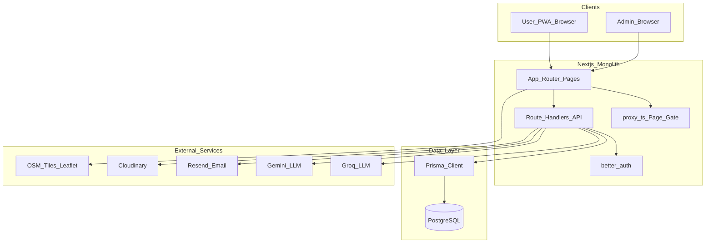
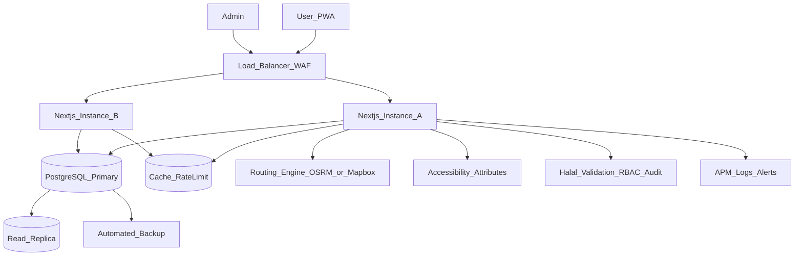
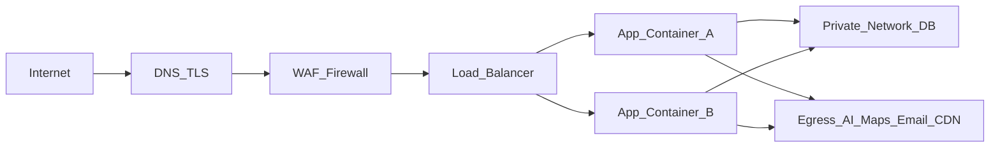
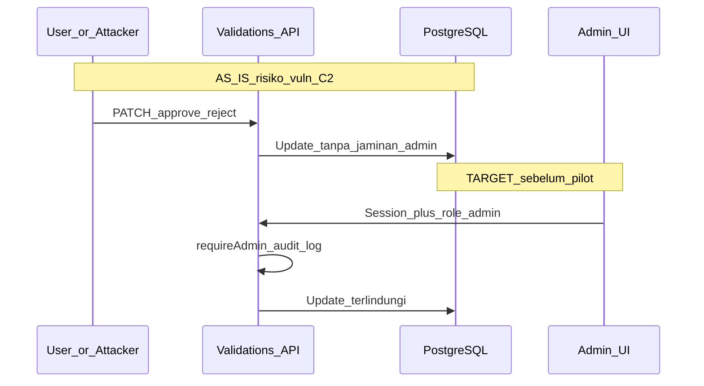
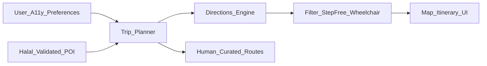

# Feasibility Study Teknis

## SAFAR: System for Accessible Friendly & Halal Travel Routes

| Item | Detail |
| --- | --- |
| Nama dokumen | Feasibility Study Teknis Aplikasi |
| Nama proyek | SAFAR (System for Accessible Friendly & Halal Travel Routes) |
| Brand produk di kode | SAFAR - Priangan Halal |
| Acuan checklist | `3. Feasibility Study Teknis Aplikasi.docx.pdf` (bagian 2–16) |
| Baseline kode | Repository `hyperlocal` (analisis berbasis bukti file) |
| Versi dokumen | 1.0 |
| Status | Draft analisis teknis |
| Metode | Hibrida: nilai MVP dari kode existing → gap analysis ke visi penuh (pilot & production) |
| Klasifikasi klaim | **Fakta** · **Asumsi** · **Estimasi** · **Data perlu dikonfirmasi** |

---

## Legenda klasifikasi

| Label | Arti |
| --- | --- |
| **Fakta** | Terverifikasi dari kode, dokumen proyek, atau sumber resmi yang dikutip |
| **Asumsi** | Digunakan untuk melanjutkan analisis saat data empiris belum ada; dinyatakan eksplisit |
| **Estimasi** | Angka perkiraan (kapasitas, durasi, biaya relatif, skor) berdasarkan praktik umum + kondisi kode |
| **Data perlu dikonfirmasi** | Belum tersedia di repo/dokumen; wajib diverifikasi sebelum keputusan formal organisasi |

---

## Success metric (kriteria kritis)

| Aspek | Bobot | Peran |
| --- | ---: | --- |
| Kelayakan akses pengguna berkebutuhan khusus | 40% | Diferensiator utama nama SAFAR (*Accessible*) — gap terbesar saat ini |
| Kepercayaan & validitas informasi halal | 35% | Fondasi kepercayaan produk |
| Kelengkapan & kualitas rute | 25% | Inti *Travel Routes* |

Ketiga aspek diperlakukan sebagai **kriteria kritis**. Kegagalan pada aksesibilitas atau validitas data halal dapat menghasilkan *no-go* untuk tahap tertentu meskipun skor teknis agregat relatif lebih tinggi.

---

# 1. Ringkasan eksekutif

### 1.1 Latar belakang

**Fakta.** Aplikasi di repository di-brand sebagai *SAFAR - Priangan Halal*, platform penemuan destinasi, kuliner, penginapan, dan fasilitas halal berbasis insight lokal (`app/manifest.ts`, `app/layout.tsx`).

**Asumsi.** Dokumen studi menargetkan visi penuh: sistem rute perjalanan yang *accessible*, *friendly*, dan *halal* — melampaui katalog wisata halal semata.

**Masalah yang ingin diselesaikan (asumsi produk, selaras nama & fitur):**

1. Informasi wisata halal terfragmentasi dan belum selalu tervalidasi.
2. Rute perjalanan belum mempertimbangkan kebutuhan akses fisik pengguna berkebutuhan khusus.
3. Pengguna sulit merencanakan perjalanan yang sekaligus memenuhi kebutuhan halal dan aksesibilitas.

### 1.2 Tujuan studi kelayakan teknis

Sesuai dokumen acuan §2.2, studi ini mengevaluasi:

- ketersediaan teknologi;
- infrastruktur;
- sumber daya teknis;
- keamanan;
- skalabilitas;
- integrasi sistem;
- risiko teknis;

dengan tambahan evaluasi khusus: kualitas data, aksesibilitas digital/fisik, dan informasi halal — dipisah per tahap **MVP / pilot / production**.

### 1.3 Kesimpulan sementara (sebelum skor final di §14)

Kesimpulan **final** ditetapkan hanya setelah scoring di bagian 14. Ringkasan arah analisis:

| Tahap | Arah sementara |
| --- | --- |
| MVP | **Layak dilanjutkan** — fondasi katalog, peta, itinerary AI, skor/validasi halal, PWA, Docker sudah ada |
| Pilot | **Belum layak** sebelum blocker keamanan, integritas validasi halal, dan data aksesibilitas diselesaikan |
| Production | **Belum layak** sebelum routing aksesibel, WCAG, backup, monitoring, dan infrastruktur produksi tersedia |

Makna frasa “layak dengan penyesuaian” (jika dipakai): fondasi proyek **masih layak dikembangkan** melalui remediation dan proof of concept — **bukan** pernyataan bahwa produk visi penuh sudah siap.

### 1.4 Kesimpulan awal dokumen acuan (§2.3) — status sementara

| Aspek | Status sementara |
| --- | --- |
| Kelayakan teknologi | Layak untuk MVP; perlu penyesuaian untuk visi penuh |
| Infrastruktur | Perlu penyesuaian |
| SDM teknis | Data perlu dikonfirmasi (estimasi di §10) |
| Keamanan sistem | Perlu perbaikan (blocker sebelum pilot) |

---

# 2. Gambaran umum dan ruang lingkup sistem

## 2.1 Deskripsi sistem

**Fakta.** SAFAR pada baseline adalah aplikasi web (Next.js App Router) + Progressive Web App yang menyediakan:

- penjelajahan destinasi, UMKM, dan akomodasi;
- peta interaktif berbasis Leaflet;
- rekomendasi/itinerary berbantuan AI (Groq untuk route-finder; Gemini untuk explore/rekomendasi);
- skor kesiapan halal berbasis pemetaan GMTI ACES;
- panel admin untuk CRUD, validasi, dan analitik.

**Gap vs visi dokumen.** Visi *Accessible Friendly & Halal Travel Routes* mensyaratkan rute yang mempertimbangkan aksesibilitas fisik/digital dan integrasi lokasi/transportasi yang andal. Itu **belum** menjadi kapabilitas inti pada baseline.

## 2.2 Fitur utama, pengguna, peran, hak akses

### Fitur utama (dokumen §3.2 — diisi untuk SAFAR)

| No | Fitur | Deskripsi | Bukti (path) | Tahap |
| --- | --- | --- | --- | --- |
| 1 | Login & authentication | Email/password, verifikasi email, reset password (better-auth + Resend) | `lib/auth.ts`, `lib/auth-email.ts`, `app/api/auth/[...all]/route.ts` | MVP |
| 2 | Dashboard admin | Ringkasan operasional & analitik | `app/(admin)/`, `app/api/dashboard/route.ts` | MVP |
| 3 | Manajemen destinasi / UMKM / akomodasi | CRUD + tampilan publik | `prisma/schema.prisma`, `app/api/destinations/`, `app/api/umkms/`, `app/api/accommodations/` | MVP |
| 4 | Peta | Marker, cluster, polyline titik-ke-titik | `components/maps/`, `app/(public)/peta/` | MVP |
| 5 | Itinerary AI | Intent → search/itinerary/facility via Groq | `app/api/assistant/route-finder/route.ts`, `lib/services/itinerary-service.ts` | MVP |
| 6 | Skor & validasi halal | ACES mapping + workflow APPROVED/REJECTED | `lib/config/halal-readiness.ts`, `lib/utils/calculate-halal-score.ts`, `app/(admin)/validasi/` | MVP (integritas perlu perbaikan) |
| 7 | Reporting | Generate laporan admin | `app/api/admin/reports/` | MVP |
| 8 | Data aksesibilitas fisik PwD | Kursi roda, ramp, toilet aksesibel, dll. | — | **Tidak ada (gap pilot)** |
| 9 | Routing aksesibel | Engine directions + constraint a11y | — | **Tidak ada (gap pilot→prod)** |
| 10 | Integrasi transportasi | Skor/transport API nyata | `lib/services/analytics-service.ts` (placeholder `transportAccessScore = 0`) | Gap |
| 11 | WCAG / a11y digital terprogram | Audit & remediasi sistematis | Aria sporadis saja; tidak ada program WCAG | Gap |

### Pengguna sistem (dokumen §3.3)

| Pengguna | Peran saat ini (**Fakta**) | Hak akses | Gap |
| --- | --- | --- | --- |
| User | Menggunakan fitur publik & akun | Jelajah, simpan, review, itinerary | Preferensi & filter aksesibilitas belum ada |
| Administrator | Mengelola data & validasi | Path admin di-gate oleh `proxy.ts` (halaman); banyak `/api/*` harus self-guard | Celah authz — lihat §7 & `vuln.md` |
| Manager | Disebut di template dokumen | **Tidak ada role terpisah** | Perlu role read-only laporan |
| Surveyor lapangan | Disebut di UI/analytics copy | Hanya field `surveyorNote` / `validatorId`, **bukan role** | Role + form lapangan a11y |

**Fakta role enum:** hanya `user` dan `admin` (`prisma/schema.prisma` enum `UserRole`; field `User.role`).

## 2.3 Ruang lingkup

| Termasuk | Tidak termasuk (saat analisis / hingga ada keputusan) |
| --- | --- |
| Evaluasi teknis baseline MVP di repo ini | Estimasi anggaran finansial detail (Data perlu dikonfirmasi) |
| Gap analysis ke visi Accessible + Halal Routes | Desain UI/UX final |
| Rekomendasi PoC, testing, deploy, ops | Implementasi perbaikan kode (di luar scope deliverable ini) |
| Perbandingan 2 alternatif teknologi | Negosiasi kontrak vendor |

---

# 3. Analisis kebutuhan teknis

## 3.1 Kebutuhan perangkat keras (dokumen §4.1)

| Komponen | Spesifikasi minimum | Rekomendasi | Klasifikasi | Tahap |
| --- | --- | --- | --- | --- |
| Server aplikasi | 1 vCPU / 2 GB RAM / 20 GB disk | 2 vCPU / 4 GB (pilot); ≥2 instance (prod) | Estimasi | MVP→Prod |
| Database PostgreSQL | 1 vCPU / 2 GB / 20 GB | 2 vCPU / 4 GB / 50–100 GB + backup | Estimasi | MVP→Prod |
| Client (pengguna) | Browser modern; 2 GB RAM perangkat | Smartphone 2019+ atau desktop | Asumsi | Semua |
| Network server | 100 Mbps shared | 100–500 Mbps dedicated / cloud egress memadai | Estimasi | Pilot+ |
| Storage media | Cloudinary (existing) | Kuota sesuai volume upload | Fakta integrasi; Data perlu dikonfirmasi kuota | Semua |

**Data perlu dikonfirmasi:** lokasi DC, penyedia cloud aktual, kapasitas produksi saat ini.

## 3.2 Kebutuhan perangkat lunak (dokumen §4.2)

| Komponen | Teknologi | Bukti | Klasifikasi |
| --- | --- | --- | --- |
| Runtime / OS container | Node.js Alpine (Docker) | `Dockerfile` | Fakta |
| Backend / BFF | Next.js 16.2.6 Route Handlers | `package.json`, `app/api/**` | Fakta |
| Frontend | React 19.2.4 + Tailwind 4 | `package.json` | Fakta |
| Database | PostgreSQL + Prisma 7 | `prisma/schema.prisma`, `@prisma/adapter-pg` | Fakta |
| Auth | better-auth | `lib/auth.ts` | Fakta |
| Maps | Leaflet / react-leaflet | `package.json`, `components/maps/` | Fakta |
| Email | Resend | `lib/auth-email.ts` | Fakta |
| Image | Cloudinary | `app/api/upload/route.ts` | Fakta |
| AI | Groq (route-finder), Gemini (explore/rec) | `.env.example`, `app/api/assistant/route-finder/route.ts`, `lib/utils/ai-gemini.ts` | Fakta |
| Server application (edge) | Tidak terdefinisi di repo (Nginx/Caddy/cloud LB) | — | Data perlu dikonfirmasi |

## 3.3 Lingkungan development, staging, production

| Lingkungan | Bukti di repo | Kebutuhan |
| --- | --- | --- |
| Development | Script `next dev`; branching email pada `NODE_ENV === "development"` (`lib/auth-email.ts`) | Lokal + DB dev |
| Staging | **Tidak ditemukan** manifest staging terpisah | Wajib sebelum pilot |
| Production | `Dockerfile` `NODE_ENV=production`; `npm start` | LB, secrets, backup, monitoring |

**Fakta:** `.env.example` adalah template tunggal — tidak membedakan staging vs production.

## 3.4 Kebutuhan database

**Fakta model inti** (`prisma/schema.prisma`): `User`, `Session`, `Destination`, `Umkm`, `Accommodation`, `HalalFacility`, `HalalCertification`, `HalalValidation`, `HalalReadinessScore`, `Itinerary`, `CoverageArea`, `Review`, `Report`, interaksi & tren, dll.

**Gap skema untuk visi penuh:** atribut aksesibilitas fisik (wheelchair access, ramp, elevator, accessible toilet, tactile/Braille, companion policy, dll.) **tidak ditemukan**.

---

# 4. Evaluasi teknologi dan arsitektur

## 4.1 Arsitektur sistem saat ini (dokumen §5.1)

## 4.2 Arsitektur target pilot → production (gap)

## 4.3 Evaluasi teknologi yang digunakan (dokumen §5.2)

| Teknologi | Alasan pemilihan (konteks SAFAR) | Risiko | Klasifikasi |
| --- | --- | --- | --- |
| Next.js 16 monolith | Satu codebase UI+API; cocok MVP cepat | Coupling; API harus self-guard | Fakta + evaluasi |
| PostgreSQL + Prisma | Relasional cocok katalog + validasi; tipe aman | Migrasi skema a11y perlu hati-hati | Fakta + evaluasi |
| better-auth | Auth modern, session DB | `role.input: true` = risiko privilege escalation (`lib/auth.ts`, `vuln.md` C1) | Fakta |
| Leaflet + OSM | Biaya peta rendah untuk MVP | Bukan engine routing; polyline lurus (`facility-route-polyline.tsx`) | Fakta |
| Groq / Gemini | Itinerary/NL cepat | Biaya, abuse tanpa rate limit, bukan jaminan rute aksesibel | Fakta + evaluasi |
| Cloudinary / Resend | Upload & email operasional | Vendor dependency | Fakta |
| Docker | Packaging production | Orkestrasi/LB belum di-repo | Fakta |

## 4.4 Backend, frontend, mobile, cloud, API

| Lapisan | Kondisi | Bukti |
| --- | --- | --- |
| Backend | Route Handlers + server actions/services | `app/api/**`, `lib/services/**`, `lib/actions/**` |
| Frontend | React Server/Client Components, shadcn/Radix | `components/**`, `app/(public)/**` |
| Mobile | **PWA only** — native app tidak ditemukan | `app/manifest.ts`, `public/sw.js`; tidak ada `ios/` / RN / Capacitor |
| Database | PostgreSQL | `prisma/schema.prisma` |
| Cloud | Integrasi SaaS; hosting fisik **Data perlu dikonfirmasi** | `.env.example` |
| API | ≈52 route handlers | `app/api/**/route.ts` |
| Offline | Shell offline; bukan offline maps/routing | `public/sw.js`, `app/offline/page.tsx` |

---

# 5. Infrastruktur dan jaringan

## 5.1 Infrastruktur server (dokumen §6.1)

| Item | Detail baseline | Target | Klasifikasi |
| --- | --- | --- | --- |
| Hosting | Docker image (`Dockerfile`) | Cloud managed | Fakta image; Data perlu dikonfirmasi provider |
| Server location | Tidak tertera di repo | Region dekat pengguna Priangan/ID | Data perlu dikonfirmasi |
| Environment | Dev + prod implied; staging lemah | Dev / Staging / Production | Fakta kelemahan |
| Backup | Tidak ditemukan script/runbook | Automated `pg_dump`/managed backup + restore drill | Fakta ketiadaan |

## 5.2 Infrastruktur jaringan (dokumen §6.2)

| Komponen | Keterangan baseline | Target pilot/prod |
| --- | --- | --- |
| Internet connection | Data perlu dikonfirmasi | Bandwidth sesuai estimasi trafik §8 |
| Firewall / WAF | Tidak ada di repo | Ya (cloud WAF) |
| VPN | Tidak ada di repo | Opsional untuk admin |
| Load balancer | Tidak ada di repo; `trustedProxyHeaders: true` di `lib/auth.ts` mengisyaratkan ekspektasi proxy | Ya untuk production |
| TLS / HTTPS | Depend deploy | Wajib end-to-end |

### Diagram jaringan target

---

# 6. Integrasi sistem dan API

## 6.1 Sistem eksternal (dokumen §7.1)

| Sistem | Metode | Status | Bukti |
| --- | --- | --- | --- |
| Resend (email) | API | Existing | `lib/auth-email.ts`, `RESEND_*` |
| Cloudinary | API | Existing | `app/api/upload/route.ts` |
| Groq | API | Existing (route-finder) | `GROQ_API_KEY`, `app/api/assistant/route-finder/route.ts` |
| Gemini | API | Existing (explore/recommendations) | `GEMINI_API_KEY`, `lib/utils/ai-gemini.ts` |
| Leaflet / OSM tiles | Client | Existing | `components/maps/**` |
| Google Maps / Mapbox / Foursquare / Geoapify | API keys di env | Collector/partial; pemakaian runtime terbatas | `.env.example`; collector **tidak ada di repo ini** |
| Routing directions (OSRM/Mapbox/Google) | — | **Tidak ada** | Grep tidak menemukan pemanggilan Directions |
| Transportasi publik/ride | — | Placeholder skor | `analytics-service.ts` |
| Push notification | — | Tidak ada | `public/sw.js` tanpa push handler |
| Payment gateway / ERP | Template dokumen umum | Di luar scope produk saat ini | — |

## 6.2 API requirement (dokumen §7.2) — ringkasan

| API group | Fungsi | Auth yang diharapkan | Kondisi |
| --- | --- | --- | --- |
| `/api/auth/*` | Registrasi, sesi | better-auth | Existing |
| `/api/destinations`, `/umkms`, `/accommodations` | Katalog | Publik read; mutasi admin | Perlu audit konsistensi |
| `/api/validations*` | Validasi halal | **Wajib admin** | Temuan kritis: endpoint dapat tanpa auth (`vuln.md` C2) |
| `/api/admin/*` | Analitik, import, AI test | **Wajib admin** | Sebagian tanpa auth (`vuln.md` C3) |
| `/api/assistant/route-finder`, `/explore`, `/recommendations` | AI | Auth + rate limit direkomendasikan | Risiko cost abuse |
| `/api/itineraries*` | CRUD itinerary | User session | Existing pattern |
| `/api/upload` | Media | Auth | Existing; rate limit kurang |

**Data perlu dikonfirmasi:** spesifikasi OpenAPI/Swagger resmi (belum ada di repo).

### Alur sistem inti — validasi halal (as-is vs target)

### Alur target — rute aksesibel

---

# 7. Keamanan dan privasi

## 7.1 Security requirement (dokumen §8.1)

| Area | Implementasi diminta dokumen | Kondisi baseline | Status |
| --- | --- | --- | --- |
| Authentication | Username/password + MFA | Email/password + verifikasi; **MFA tidak ada** | Partial |
| Authorization | RBAC | 2 role; celah privilege & API | **Lemah** |
| Data encryption | HTTPS/TLS | Depend deploy; security headers kurang (`vuln.md` M1) | Partial |
| Database security | Access control | Kredensial via `DATABASE_URL`; encryption-at-rest **Data perlu dikonfirmasi** | Partial |
| Logging / audit | Audit log | **Tidak ada** model `AuditLog`; session simpan IP/UA saja | Gap |
| Privasi lokasi | — | Kebijakan di `app/(public)/privacy/page.tsx` (GPS jika diizinkan); consent manager teknis tidak ditemukan | Partial |
| Backup | — | Tidak ditemukan | Gap |

## 7.2 Temuan keamanan penting (bukti)

Sumber audit: `vuln.md` (Security Vulnerability Analysis — Hyperlocal / Safar).

| ID | Temuan | Path bukti | Dampak pada SAFAR |
| --- | --- | --- | --- |
| C1 | `role` dapat di-set dari client (`input: true`) | `lib/auth.ts` | Privilege escalation → admin palsu |
| C2 | Validasi halal API tanpa auth memadai | `app/api/validations/**` | Merusak **kepercayaan data halal** (kriteria kritis 35%) |
| C3 | Endpoint admin/AI tanpa auth | `app/api/admin/**`, AI routes | Abuse biaya LLM, kebocoran analitik |
| C4 | Server actions mutasi tanpa `requireAdmin` | `lib/actions/**` | Manipulasi katalog |
| H2 | Tidak ada rate limiting | — | Brute force / cost abuse |
| H3 | `/api/*` dikecualikan dari gate `proxy.ts` | `proxy.ts` matcher | Setiap API wajib self-guard |

## 7.3 Risiko keamanan (dokumen §8.2)

| Risiko | Dampak | Mitigasi | Kontingensi |
| --- | --- | --- | --- |
| Unauthorized access / privilege escalation | Tinggi | `role.input: false`; RBAC ketat; MFA admin | Freeze registrasi & rotasi sesi |
| Data leakage / manipulasi validasi halal | Tinggi | Authz pada validations; audit trail | Nonaktifkan approve publik; rollback flag |
| Abuse AI / malware probing | Sedang–tinggi | Rate limit, WAF, auth | Matikan AI sementara |
| Location privacy misuse | Sedang | Consent UX, minimasi retensi, kebijakan jelas | Matikan geolocation non-esensial |

---

# 8. Skalabilitas dan performa

## 8.1 Perkiraan beban sistem (dokumen §9.1)

| Parameter | MVP | Pilot | Production | Klasifikasi |
| --- | ---: | ---: | ---: | --- |
| Pengguna terdaftar | 100–1.000 | 1.000–10.000 | 10.000+ | Asumsi / Estimasi |
| Request per hari | 5.000–50.000 | 50.000–300.000 | 300.000+ | Asumsi / Estimasi |
| Pertumbuhan data | Seed + UGC kecil | + data survey a11y | Multi-wilayah | Estimasi; Data perlu dikonfirmasi GB/tahun |
| Panggilan AI / hari | Ratusan–ribuan | Perlu kuota ketat | Kuota + cache intent | Estimasi |

## 8.2 Strategi skalabilitas (dokumen §9.2)

| Strategi | Baseline | Rekomendasi tahap |
| --- | --- | --- |
| Horizontal scaling | Single container pattern | Pilot: 2 instance; Prod: autoscaling |
| Database optimization | Indeks Prisma sebagian ada | Review query itinerary/map; replica read |
| Caching | Hanya PWA cache statis (`public/sw.js`) | Redis/CDN untuk katalog & tile policy |
| Load balancing | Belum ada di repo | Prod wajib |
| Cloud auto scaling | Belum ada | Prod |
| Rate limiting AI/auth | Belum ada | **Sebelum pilot** |

---

# 9. Kualitas data, aksesibilitas, dan informasi halal

## 9.1 Kualitas data destinasi, rute, fasilitas

| Aspek | Kondisi | Bukti | Risiko |
| --- | --- | --- | --- |
| Sumber data | Seed dari crawl cache; `externalId` / `externalSource` | `prisma/seed.ts`, `ExternalPlaceSource` | Akurasi POI tidak dijamin |
| Collector | Disebut di komentar seed; **paket tidak di repo** | `prisma/seed.ts` comment `data-collector` | Reproduktibilitas pipeline |
| Validasi | Workflow PENDING/APPROVED/REJECTED | `app/(admin)/validasi/**` | Bisa dikompromikan jika authz lemah |
| Rute | AI teks + garis lurus peta | `route-finder`, `facility-route-polyline.tsx` | Bukan rute jalan/aksesibel |
| Pembaruan data | Manual admin + seed | — | Stale data |
| Disclaimer halal | Ada di terms | `app/(public)/terms/page.tsx` | Pengguna harus paham batasan jaminan |

## 9.2 Aksesibilitas digital dan fisik

| Dimensi | Bobot success | Kondisi | Bukti | Penilaian kesiapan |
| --- | ---: | --- | --- | --- |
| Akses fisik PwD (wheelchair, ramp, toilet aksesibel, dll.) | Bagian utama 40% | **Tidak ada data model** | Grep schema/UI negatif; `ACCESSIBILITY` di ACES = *Transport Infrastructure* (`lib/config/halal-readiness.ts`) | Sangat rendah |
| Akses digital (WCAG) | Bagian 40% | Aria/`sr-only` sporadis; tidak ada program audit | Contoh: `components/ui/navbar.tsx`; tidak ada suite axe/WCAG docs | Rendah |
| GMTI Access pillar | Terkait halal framework | Ada sebagai skor fasilitas | `lib/config/halal-readiness.ts` | Jangan disamakan dengan a11y PwD |

**Catatan penting:** Pada GMTI, pillar *Access* historis menekankan konektivitas/transport; fokus 2024–2025 menekankan accessible travel lebih luas (sumber: Mastercard-CrescentRating GMTI). Implementasi kode saat ini **belum** memodelkan fasilitas disabilitas.

## 9.3 Informasi halal

| Kapabilitas | Ada? | Bukti | Catatan kepercayaan |
| --- | --- | --- | --- |
| Skor ACES berbobot | Ya | `calculate-halal-score.ts`, `halal-readiness.ts` | Metodologi ada |
| Sertifikasi & validasi | Ya | `HalalCertification`, `HalalValidation` | Integritas proses = risiko keamanan |
| Analytics readiness / gap | Ya | `app/api/admin/analytics/halal-readiness/**` | Bergantung data bersih |
| Jaminan mutlak halal | Tidak (disclaim) | `terms` | Benar secara produk; komunikasi harus jelas |

---

# 10. Kebutuhan SDM dan estimasi implementasi

## 10.1 Kebutuhan tim (dokumen §10.1)

| Role | Jumlah | Keahlian | Gap vs kebutuhan visi | Klasifikasi |
| --- | ---: | --- | --- | --- |
| Project Manager | 1 | Manajemen lingkup MVP→pilot | — | Estimasi |
| Backend / Fullstack | 2 | Next.js, Prisma, authz, API | Wajib untuk P0 security | Estimasi |
| Frontend + Digital a11y | 1–2 | React, WCAG 2.2 | **Kesenjangan** spesialis a11y | Estimasi |
| Data / GIS / Routing | 1 | GeoJSON, OSRM/Mapbox, constraints | **Kesenjangan** | Estimasi |
| QA (termasuk uji PwD) | 1 | E2E, a11y testing | **Kesenjangan** uji pengguna berkebutuhan khusus | Estimasi |
| DevOps | 0.5–1 | Docker, staging, backup, monitoring | **Kesenjangan** | Estimasi |
| Domain halal + surveyor | 1+ | Validasi lapangan, protokol a11y fisik | Proses non-kode krusial | Asumsi kebutuhan operasional |

**Data perlu dikonfirmasi:** personel aktual organisasi / universitas / mitra.

## 10.2 Estimasi tahapan implementasi (dokumen §11) — jalur gap, bukan greenfield

| Tahapan | Durasi (estimasi) | Output | Dependensi |
| --- | --- | --- | --- |
| Hardening keamanan & RBAC | 2–3 minggu | P0 security closed | Keputusan prioritas |
| Model data aksesibilitas + admin/survey | 3–4 minggu | Schema + UI + protokol survei | Domain expert |
| WCAG remediation alur kritis | 2–3 minggu (paralel) | AA pada login, cari, peta, itinerary | FE + QA |
| PoC routing aksesibel | 3–4 minggu | Engine + filter constraint | API key/budget maps |
| Integrasi pilot + UAT PwD | 3–4 minggu | Pilot terbatas wilayah | Data lapangan |
| Production hardening | 4–6 minggu | Backup, LB, monitoring, MFA, DR | Infra dikonfirmasi |

**Milestone:**

1. **M1** — Security P0 selesai → gate teknis menuju persiapan pilot.
2. **M2** — Data a11y + PoC routing lulus kriteria → kandidat pilot.
3. **M3** — UAT PwD + staging stabil → pilot launch.
4. **M4** — WCAG kritis + ops production → gate production.

---

# 11. Analisis risiko

| Risiko | Probabilitas | Dampak | Tingkat | Mitigasi | Rencana kontingensi |
| --- | --- | --- | --- | --- | --- |
| Tidak ada data aksesibilitas fisik | Tinggi | Tinggi | **Kritis** | Schema + survei + sumber data resmi | Pilot 1 kota/area sempit + rute kurasi manual |
| Manipulasi validasi halal (authz) | Tinggi | Tinggi | **Kritis** | Fix C1–C4; audit log | Freeze workflow validasi; review ulang data |
| AI itinerary disamakan dengan rute aman/aksesibel | Tinggi | Tinggi | Tinggi | PoC routing + constraint; label UX jujur | Rute kurasi manusia |
| Abuse / biaya LLM | Sedang | Tinggi | Tinggi | Auth + rate limit + budget cap | Disable AI |
| Data crawl tidak akurat | Sedang | Tinggi | Tinggi | Sampling validasi; confidence flag | Disclaimer + hide skor rendah |
| Kekurangan SDM a11y/GIS | Sedang | Sedang | Sedang | Hire/training/mitra | Perkecil scope pilot |
| Vendor lock AI/maps | Sedang | Sedang | Sedang | Abstraksi provider | Fallback OSM + OSRM self-host |
| Kegagalan integrasi routing | Sedang | Tinggi | Tinggi | PoC awal; kontrak SLA | Tunda fitur rute; fokus katalog+a11y filter dulu |
| Ketidaksesuaian staging/prod | Sedang | Sedang | Sedang | Env terpisah sejak pilot | Hotfix dengan change freeze |
| Privasi lokasi | Rendah–sedang | Sedang | Sedang | Consent + minimasi data | Matikan fitur geo nonkritis |

---

# 12. Perbandingan alternatif teknologi

## Alternatif

| | **Alternatif A (rekomendasi lanjutkan)** | **Alternatif B** |
| --- | --- | --- |
| Ringkasan | Pertahankan Next.js monolith + PostgreSQL + Leaflet; tambah OSRM atau Mapbox Directions + model a11y; PWA-first | Pisah backend (NestJS/FastAPI) + Next/React Native + Google Maps Platform penuh |

## Matriks kriteria

| Kriteria | Alternatif A | Alternatif B | Catatan |
| --- | --- | --- | --- |
| Biaya | Lebih rendah jangka pendek (reuse kode) | Lebih tinggi (rewrite + native + Maps bill) | Estimasi relatif |
| Performa | Cukup untuk MVP–pilot awal | Potensi lebih baik jika service dipisah | Bergantung desain |
| Keamanan | Bisa setara jika authz diperbaiki | Surface area lebih luas (lebih banyak service) | A tetap butuh fix P0 |
| Skalabilitas | Vertikal+horizontal app container | Lebih fleksibel jangka panjang | Overkill jika pilot sempit |
| Maintenance | Satu repo — lebih sederhana | Multi-repo/service — lebih mahal SDM | |
| Integrasi | Cepat ke fitur existing | Perlu rebuild kontrak API | |
| Ketersediaan tenaga ahli | Tinggi untuk Next/TS | Perlu RN + backend terpisah | Estimasi pasar ID |

**Rekomendasi:** pilih **Alternatif A** untuk jalur remediation → PoC → pilot, karena sunk cost baseline tinggi dan time-to-pilot lebih cepat. Evaluasi ulang Alternatif B hanya jika **Data perlu dikonfirmasi** menetapkan native offline routing sebagai requirement keras production.

---

# 13. Rekomendasi teknis

## 13.1 Proof of Concept (wajib)

| PoC | Tujuan | Kriteria lulus (usulan) |
| --- | --- | --- |
| PoC-1 Security & Halal Integrity | Tutup privilege escalation + authz validations | Tidak ada approve tanpa admin; role tidak bisa di-self-assign |
| PoC-2 Accessibility Data | Model + 1 wilayah sample + filter UI | ≥ N POI beratribut a11y terverifikasi (**N = Data perlu dikonfirmasi**) |
| PoC-3 Accessible Routing | Directions engine + constraint (mis. avoid steps) | Rute terhitung di jalan nyata; fallback jika constraint gagal |
| PoC-4 WCAG critical path | Login, pencarian, detail destinasi, peta, itinerary | Tidak ada violation critical/serious pada axe; uji 1 pengguna AT (**Asumsi protokol**) |

## 13.2 Strategi testing

- Unit/integration pada authz helpers dan skor halal.
- E2E alur user & admin.
- Security regression untuk C1–C4.
- Accessibility: automated (axe) + manual screen reader + uji pengguna berkebutuhan khusus.
- Load/rate-limit test pada AI endpoints.
- Data quality sampling (akurasi koordinat, fasilitas, sertifikasi).

## 13.3 Deployment, monitoring, operasional, pemeliharaan

| Area | Rekomendasi |
| --- | --- |
| Deployment | CI/CD; tiga environment; migrasi Prisma terkendali; secrets manager |
| Monitoring | APM, error tracking, uptime, biaya LLM, alert authz failures |
| Operasional | Runbook incident; on-call ringan untuk pilot |
| Pemeliharaan | Review data halal & a11y berkala; rotasi API key; restore drill bulanan |
| Backup/DR | Automated backup DB; RPO/RTO **Data perlu dikonfirmasi** |

---

# 14. Matriks gap, blocker, scoring, dan kesimpulan kelayakan

## 14.1 Matriks gap MVP – Pilot – Production

| Kapabilitas | MVP (baseline) | Pilot (target) | Production (target) |
| --- | --- | --- | --- |
| Katalog destinasi/UMKM/akomodasi | Ada | Enrichment a11y fields | Multi-wilayah + SLA data |
| Peta Leaflet | Ada | + rute engine | + kebijakan tile/CDN; offline opsional |
| Itinerary AI | Ada | Constraint halal+a11y + rate limit | Cache, evaluasi kualitas, human override |
| Skor/validasi halal | Ada (integritas lemah) | Authz + audit wajib | Sertifikasi terverifikasi + monitoring penyalahgunaan |
| Role model | user/admin | + surveyor/validator | RBAC penuh + MFA admin |
| Data aksesibilitas fisik | Tidak ada | Schema + survei wilayah pilot | Cakupan luas + pembaruan berkala |
| WCAG program | Tidak ada | AA alur kritis | Continuous a11y CI + kebijakan |
| Routing aksesibel | Tidak ada (polyline lurus) | PoC → fitur terbatas | Stabil + fallback |
| Transport integration | Placeholder | 1 integrasi/skor nyata | Multi-provider |
| Staging env | Lemah | Wajib | Wajib |
| Backup / monitoring / LB | Tidak ada di repo | Backup + monitoring minimal | LB + DR + autoscaling |
| Push / native | Tidak ada | Opsional | Sesuai kebutuhan terkonfirmasi |
| Audit trail | Tidak ada | Minimal admin actions | Lengkap + retensi |

## 14.2 Blocker P0 sebelum pilot

| ID | Blocker | Bukti | Alasan P0 |
| --- | --- | --- | --- |
| P0-1 | Privilege escalation via `role` input | `lib/auth.ts` (`input: true`); `vuln.md` C1 | Menghancurkan seluruh trust boundary |
| P0-2 | Validasi halal dapat dimanipulasi tanpa auth admin | `app/api/validations/**`; `vuln.md` C2 | Kriteria kritis halal 35% |
| P0-3 | Endpoint admin/AI terbuka / kurang proteksi | `app/api/admin/**`, AI routes; `vuln.md` C3 | Kebocoran + biaya |
| P0-4 | Server actions mutasi tanpa guard role | `lib/actions/**`; `vuln.md` C4 | Integritas katalog |
| P0-5 | Rate limiting absen pada auth/AI/upload | `vuln.md` H2 | Abuse sebelum skala pilot |
| P0-6 | Belum ada model & pipeline data aksesibilitas fisik | Schema/UI tidak memuat atribut PwD | Success metric 40% — tanpa ini pilot menyalahi diferensiator SAFAR |
| P0-7 | Staging + backup minimal belum tersedia | Tidak ada bukti di repo | Pilot tanpa rollback/DR operasional tidak bertanggung jawab |

## 14.3 Perhitungan skor teknis (transparan)

Skala skor aspek: **1 = sangat tidak siap** … **5 = sangat siap** untuk kebutuhan tahap yang dinilai (visi penuh sebagai acuan skor “kesiapan”, bukan “kelayakan bisnis”).

| Aspek | Bobot (w) | Skor (s) 1–5 | Nilai (w×s) | Status | Catatan / bukti ringkas |
| --- | ---: | ---: | ---: | --- | --- |
| Teknologi | 0.08 | 4 | 0.32 | Relatif kuat | Next/Prisma/Leaflet/AI ada (`package.json`) |
| Infrastruktur | 0.07 | 2 | 0.14 | Lemah | Docker ada; staging/backup/LB tidak |
| Integrasi | 0.08 | 3 | 0.24 | Sedang | Email/maps/AI ada; routing/transport gap |
| Keamanan | 0.10 | 2 | 0.20 | Lemah | `vuln.md` CRITICAL |
| Skalabilitas | 0.06 | 3 | 0.18 | Sedang | Cukup awal; cache/LB belum |
| SDM | 0.06 | 2 | 0.12 | Lemah / konfirmasi | Gap a11y–GIS–DevOps (estimasi) |
| Data | 0.07 | 3 | 0.21 | Sedang | Seed+validasi; collector luar repo |
| Aksesibilitas | 0.18 | 1 | 0.18 | Sangat lemah | Tidak ada model PwD; WCAG tidak terprogram |
| Informasi halal | 0.16 | 3 | 0.48 | Sedang (trust tergerus) | Fitur skor/validasi ada; authz merusak kepercayaan |
| Operasional | 0.05 | 2 | 0.10 | Lemah | Monitoring/DR tidak ada di repo |
| Waktu implementasi | 0.04 | 3 | 0.12 | Sedang | Estimasi gap 4–6+ bulan |
| Risiko | 0.05 | 2 | 0.10 | Tinggi | A11y + security dominan |
| **Total** | **1.00** | — | **2.39** | — | Rata tertimbang teknis = **2.39 / 5** |

Interpretasi total teknis **2.39/5**: kesiapan infrastruktur teknis menuju visi penuh **masih rendah–sedang**. Ini **bukan** skor kelayakan produk jadi.

### Overlay success metric (kesiapan visi penuh)

| Aspek kritis | Bobot | Skor kesiapan (1–5) | Nilai | Dasar skor |
| --- | ---: | ---: | ---: | --- |
| Akses pengguna berkebutuhan khusus | 0.40 | 1.5 | 0.60 | Model fisik absen; digital minimal |
| Kepercayaan & validitas info halal | 0.35 | 2.5 | 0.875 | Kapabilitas ada; dikurangi karena P0 authz |
| Kelengkapan & kualitas rute | 0.25 | 2.0 | 0.50 | AI itinerary ada; routing aksesibel tidak |
| **Total tertimbang** | **1.00** | — | **1.975 ≈ 1.98 / 5** | — |

**Interpretasi 1,98/5:** tingkat **kesiapan rendah** terhadap visi *Accessible Friendly & Halal Travel Routes*. Angka ini mengukur readiness, **bukan** izin mengklaim produk penuh layak rilis. Frasa “layak dengan penyesuaian” hanya berarti **fondasi MVP masih layak dikembangkan** melalui remediation dan PoC — bukan go production.

## 14.4 Keputusan go / no-go per tahap

### A. Kelayakan melanjutkan MVP

| Keputusan | **GO — layak dilanjutkan** |
| --- | --- |
| Alasan | Stack dan fitur inti (katalog, peta, itinerary AI, skor/validasi halal, PWA, Docker) sudah tersedia dan dapat menjadi landasan iterasi |
| Syarat berjalan | Prioritaskan remediasi keamanan bahkan selama pengembangan MVP; jangan perluas fitur publik yang memperkuat trust palsu pada validasi |

### B. Kelayakan memasuki pilot

| Keputusan | **NO-GO** saat ini |
| --- | --- |
| Alasan | Blocker P0 keamanan, integritas validasi halal, dan ketiadaan data aksesibilitas (diferensiator 40%) belum terselesaikan; staging/backup minimal belum terbukti |
| Syarat menjadi GO | Semua P0-1…P0-7 tertutup; PoC-1…PoC-3 lulus; UAT terbatas dengan pengguna berkebutuhan khusus pada wilayah pilot |

### C. Kelayakan memasuki production

| Keputusan | **NO-GO** saat ini |
| --- | --- |
| Alasan | Routing aksesibel belum ada; WCAG belum terprogram; backup, monitoring, LB/DR, MFA admin, dan infrastruktur produksi belum tersedia |
| Syarat menjadi GO | Pilot stabil + M4 production hardening selesai; success metric a11y & halal mencapai ambang yang disepakati sponsor (**Data perlu dikonfirmasi** ambang formal, usulan minimal skor overlay ≥ 3.5/5) |

### D. Keputusan dokumen acuan §14 (kotak kelayakan)

Sesuai template:

- ☐ Layak dikembangkan *(tanpa penyesuaian material)* — **tidak dipilih**
- ☑ **Layak dengan beberapa penyesuaian** — dalam arti: fondasi MVP layak diteruskan via remediation + PoC; **bukan** siap pilot/production
- ☐ Tidak layak dikembangkan — **tidak dipilih** (fondasi teknis MVP memadai untuk dilanjutkan)

**Alasan ringkas:** teknologi baseline tersedia, namun risiko keamanan kritikal dan gap aksesibilitas/rute menghalangi lompatan tahap tanpa penyesuaian material.

---

# 15. Checklist seluruh kriteria dokumen acuan (bagian 2–16)

Acuan: `3. Feasibility Study Teknis Aplikasi.docx.pdf`.

| Bagian dokumen | Subbagian | Status pengisian analisis | Catatan |
| --- | --- | --- | --- |
| 2 Ringkasan eksekutif | 2.1 Latar belakang | ✅ | Diisi spesifik SAFAR |
| | 2.2 Tujuan studi | ✅ | |
| | 2.3 Kesimpulan awal | ✅ | Status sementara + final di §14 |
| 3 Gambaran umum | 3.1 Deskripsi sistem | ✅ | |
| | 3.2 Fitur utama | ✅ | Tabel + tahap |
| | 3.3 Pengguna sistem | ✅ | termasuk Manager/Surveyor gap |
| 4 Kebutuhan teknis | 4.1 Hardware | ✅ | Estimasi ditandai |
| | 4.2 Software | ✅ | |
| 5 Evaluasi teknologi | 5.1 Arsitektur | ✅ | Mermaid as-is + target |
| | 5.2 Evaluasi teknologi | ✅ | |
| 6 Infrastruktur | 6.1 Server | ✅ | |
| | 6.2 Jaringan | ✅ | Mermaid target |
| 7 Integrasi | 7.1 Sistem eksternal | ✅ | |
| | 7.2 API requirement | ✅ | |
| 8 Keamanan | 8.1 Security requirement | ✅ | |
| | 8.2 Risiko keamanan | ✅ | + bukti `vuln.md` |
| 9 Skalabilitas | 9.1 Beban | ✅ | Asumsi eksplisit |
| | 9.2 Strategi | ✅ | |
| 10 SDM | 10.1 Kebutuhan tim | ✅ | |
| 11 Estimasi implementasi | Tahapan/durasi/output | ✅ | Jalur gap hybrid |
| 12 Risiko teknis | Tabel risiko | ✅ | + kontingensi |
| 13 Alternatif teknologi | Perbandingan A vs B | ✅ | Rekomendasi A |
| 14 Kesimpulan feasibility | Kotak layak / penyesuaian / tidak | ✅ | + go/no-go per tahap |
| 15 Validasi dokumen | Lembar persetujuan | ⚠️ | **Data perlu dikonfirmasi** — nama/jabatan penandatangan organisasi |
| 16 Lampiran | Arsitektur, ERD, network, API, PoC, estimasi infra | ⚠️ Partial | Mermaid di badan dokumen; ERD penuh & hasil PoC = lampiran kerja berikutnya |

### Checklist perluasan analisis (di luar template, diminta studi ini)

| Kriteria perluasan | Status |
| --- | --- |
| Kualitas data destinasi/rute/halal | ✅ |
| Aksesibilitas digital & fisik | ✅ |
| Informasi halal & kepercayaan | ✅ |
| Bukti path kode per temuan penting | ✅ |
| Blocker P0 sebelum pilot | ✅ |
| Matriks gap MVP–Pilot–Production | ✅ |
| Perhitungan skor transparan | ✅ |
| Diagram Mermaid | ✅ |
| Go/no-go per tahap | ✅ |
| Klasifikasi Fakta/Asumsi/Estimasi/Data perlu dikonfirmasi | ✅ |

---

# 16. Lampiran kerja (indeks)

| Lampiran | Lokasi / status |
| --- | --- |
| Diagram arsitektur as-is | §4.1 (Mermaid) |
| Diagram arsitektur target | §4.2 (Mermaid) |
| Diagram jaringan target | §5.2 (Mermaid) |
| Alur validasi halal & rute aksesibel | §6 (Mermaid) |
| ERD database | Sumber: `prisma/schema.prisma` (render ERD visual = tindak lanjut) |
| Dokumentasi API | ≈52 route di `app/api/**` — spek OpenAPI belum ada |
| Hasil Proof of Concept | Belum dijalankan — lihat rencana PoC §13.1 |
| Estimasi infrastruktur | §3.1, §8 |
| Audit keamanan baseline | `vuln.md` |
| Acuan template studi | `3. Feasibility Study Teknis Aplikasi.docx.pdf` |

### Referensi eksternal (kerangka halal / accessible travel)

- Mastercard-CrescentRating Global Muslim Travel Index (GMTI) — kerangka ACES; penekanan accessible travel pada edisi terbaru (2024–2025).  
  Detail metrik operasional produk tetap harus diturunkan ke skema data SAFAR (**jangan** menyamakan pillar Access GMTI dengan checklist PwD tanpa desain eksplisit).

---

# 17. Syarat gerbang tahap (ringkas operasional)

## Sebelum melanjutkan pengembangan gap di atas MVP

1. Tutup P0-1 … P0-5 (keamanan & integritas halal).
2. Sepakati skema atribut aksesibilitas fisik + sumber data survei.
3. Nyatakan di UX bahwa itinerary AI **bukan** navigasi aksesibel hingga PoC-3 lulus.

## Sebelum pilot

1. Semua P0 termasuk P0-6 dan P0-7.
2. PoC-1…PoC-3 lulus kriteria.
3. Staging terpisah + backup teruji restore.
4. UAT dengan pengguna berkebutuhan khusus (protokol **Data perlu dikonfirmasi**).

## Sebelum production

1. Routing aksesibel stabil + fallback.
2. WCAG pada alur kritis (PoC-4) + proses regresi.
3. LB, monitoring, MFA admin, DR dengan RPO/RTO disepakati.
4. Ambang success metric overlay disepakati sponsor dan tercapai.
5. Rate limit, budget AI, dan audit trail operasional.

---

**Dokumen ini tidak mengubah kode aplikasi.** Persetujuan formal organisasi (bagian 15 template) memerlukan penandatangan — **Data perlu dikonfirmasi**.
